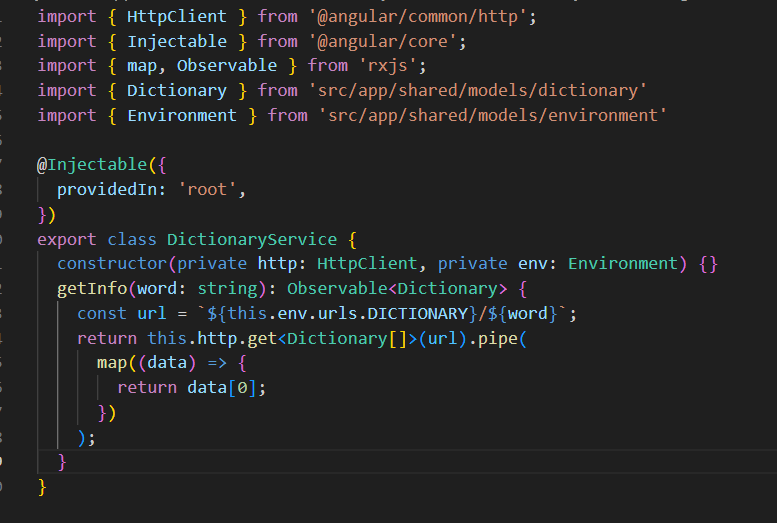
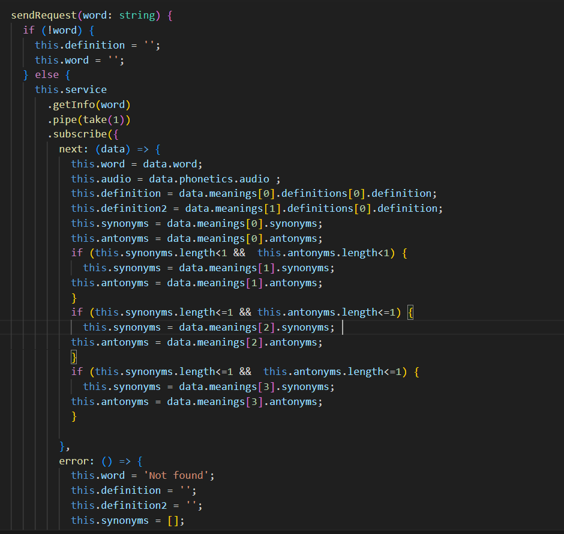

# MeriDictionary
Angular app using Open Dictionary API
This project was made for the subject client side technologies

# Dictionary
The "Dictionary" application is a web-based tool designed to provide users with quick access to definitions, meanings, antonyms, and synonyms of words. Its main functionality revolves around leveraging the DictionaryAPI to fetch relevant information and present it in a user-friendly manner.
When a user enters a word into the search bar, the application sends a request to the DictionaryAPI, which retrieves the corresponding data. The retrieved information includes the definition, various meanings, antonyms (opposite words), and synonyms (similar words) for the entered word.
The application then displays the retrieved data in a neatly organized format, making it easy for users to understand and navigate through the word's different aspects. The definitions offer clear explanations of the word's meaning, while the meanings section provides additional context and usage examples.
For users looking to expand their vocabulary or find alternative words, the antonyms and synonyms sections are invaluable. The antonyms offer opposites that can enhance the user's understanding of the word's nuances, while the synonyms provide alternative words that can be used interchangeably in different contexts.
The application's user interface is designed to be intuitive and user-friendly, with a clean layout that allows for smooth navigation. Users can quickly switch between different sections and explore various aspects of a word's meaning with just a few clicks.
Overall, the "Dictionary" application offers a convenient and efficient way for users to access comprehensive word information in a single place. It serves as a valuable tool for students, writers, language enthusiasts, and anyone seeking to improve their vocabulary or explore the intricacies of language.

                                                             
# Description of architecture
The architecture of the "Dictionary" application follows the Angular framework's component-based structure. The main components involved in the application are the search form component and the input component.
The search form component is responsible for displaying the search bar and handling user interactions. It is represented by the HTML code provided, which includes an input field for the user to enter the word and a submit button to initiate the search. The form is bound to the "handleSubmit" method in the input component, which is triggered when the form is submitted. This component is crucial for capturing user input and initiating the search process.
The input component, represented by the provided TypeScript code, is responsible for emitting an event to notify the application about the user's search request. It imports necessary dependencies from the Angular core and forms modules. The "@Output" decorator and the "sendRequest" property define an event emitter that emits the user's entered word as a string. The "handleSubmit" method is invoked when the form is submitted, and it emits the value to the parent component using the "sendRequest" event emitter.

The architecture and components work together to enable the user to enter a word in the search bar, submit the form, and trigger a search request. The input component captures the user's input and emits it to the parent component, which further processes the request and fetches relevant data from the DictionaryAPI. The emitted value acts as a parameter for the API request, allowing the application to retrieve definitions, meanings, antonyms, and synonyms for the entered word and display them to the user.
The provided CSS code demonstrates the styling of the search container, form, input field, and submit button. It defines the layout and visual appearance of the search bar, making it visually appealing and user-friendly.
In summary, the architecture of the "Dictionary" application incorporates a search form component and an input component, working together to capture user input, emit search requests, and facilitate the retrieval and display of word-related information.

# Description of client server communication
The client-server communication in the "Dictionary" application is facilitated by the HttpClient module in Angular. The provided TypeScript code demonstrates the usage of HttpClient to send requests to the DictionaryAPI and retrieve word-related information.
The Environment class, contains the URL for the DictionaryAPI. It defines the DICTIONARY URL as 'https://api.dictionaryapi.dev/api/v2/entries/en'.
The DictionaryService class is responsible for making the HTTP requests to the API and processing the response. It imports the necessary dependencies, including HttpClient, Injectable, map, Observable, and the Dictionary and Environment models.

The constructor of the DictionaryService class injects the HttpClient and Environment dependencies, allowing us to make HTTP requests and access the API URL.
The getInfo() method in the DictionaryService class takes a word as a parameter and returns an Observable of type Dictionary. It constructs the API URL by appending the word to the DICTIONARY URL from the Environment class. The HttpClient's get() method is used to make a GET request to the constructed URL.
The response from the API is an array of Dictionary objects. The map() operator is applied to the response data to transform it. In this case, we extract the first element from the array and return it as the result.
By using the HttpClient module and the DictionaryService, the application can send a request to the DictionaryAPI, passing the entered word as a parameter. The API responds with word-related data in the form of a Dictionary object, which is then processed and used to display the information to the user.

In the AppComponent, we have a method sendRequest(word: string) which is triggered when the sendRequest event is emitted from the InputComponent or any other component that uses the AppComponent.Inside the sendRequest method, we first check if the word parameter is empty. If it is, we reset the definition and word properties to empty values.If the word is not empty, we call the getInfo method from the DictionaryService, passing the word as a parameter. We use the pipe operator to take only one emission of the observable using the take operator.
In the subscription, we handle the response using the next and error callbacks. In the next callback, we assign the received data to the appropriate properties in the AppComponent such as word, audio, definition, definition2, synonyms, and antonyms. We handle different cases for retrieving synonyms and antonyms based on the available

